# **Milestone 3 – Url of Sandwich**

## **Sandwich Recipe Database**

---

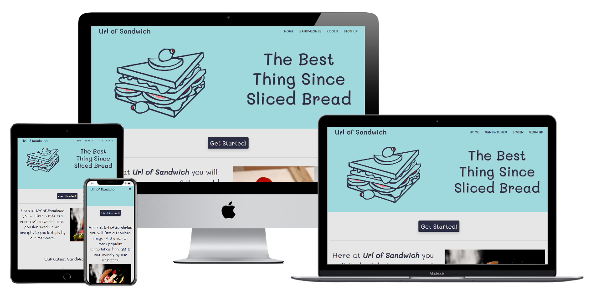
This webpage has been created to showcase the skills I have learned in the Datacentric Developement section of the Code Institute Full Stack Web Developer course; this is the third of four projects that I will be creating for the course.
For this project I have chosen to create a sandwich recipe website using the MongoDB database, Python, Flask and Jinja.
The reason for this selection is to create a website that users can interact with by joining the website, being able to view other people's creations and adding there own sandwiches to the database.

---

### **_Table of contents:_**

1. [Description](#sandwich-recipe-database)
2. [UX](#ux)
    1. [The Objective](#the-objective)
    2. [Wireframes](#wireframes)
    3. [Styling](#styling)
    4. [User Stories](#user-stories)
3. [Features](#features)
    1. [Existing Features](#existing-features)
    2. [Features Left to Implement](#features-left-to-implement)
4. [Technology Used](#technology-used)
5. [Testing](#testing)
    1. [Testing User Stories](#testing-user-stories)
    2. [Code Validation](#code-validation)
    3. [Manual Testing](manual-testing)
6. [Deployment](#deployment)
    1. [Remote Deployment](#remote-deployment)
    2. [Local Deployment](#local-deployment)
7. [Credits](#credits)
    1. [Content](#content)
    2. [Media](#media)
    3. [Acknowledgements](#acknowledgements)

---

## **UX**

### **The Objective**

The objective of this website is to provide users that love sandwiches with an application that allows them to sign up, login, create and edit their own sandwiches as well as browse the creations of other users for inspiration.

On this site a user is able to:

- view sandwich recipes created by other users
- read the ingredients needed for each sandwich
- read the instructions on how to create each sandwich
- see which user created each sandwich
- see an image of each sandwich (if added by the creator)
- sign up to an account
- login as an existing user
- log out of their account
- view their profile page showing the sandwiches they have created (if any)
- edit sandwich recipes they have created
- delete sandwich recipes they have created

### **Wireframes**
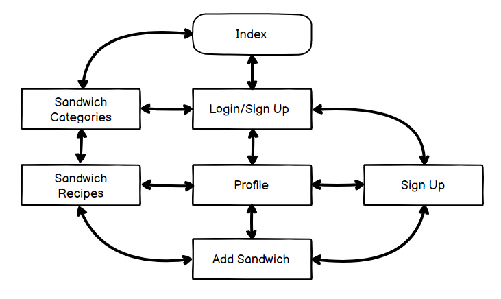
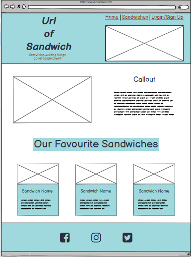
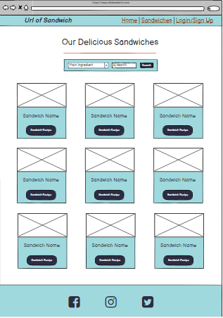
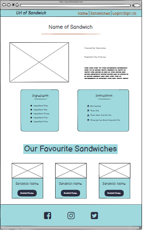
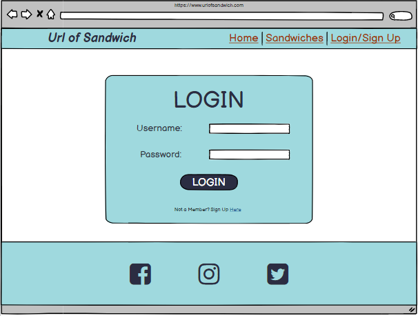
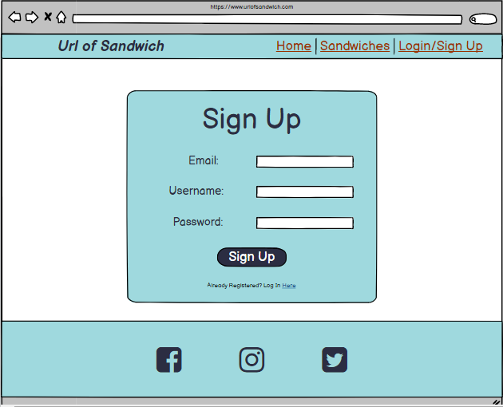
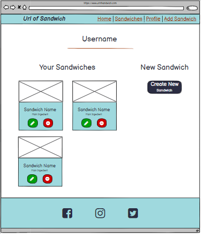
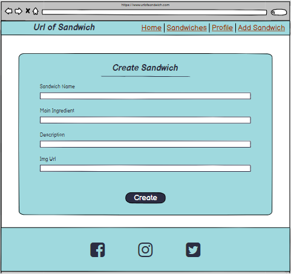

you can find a full size PDF of the Wireframes [here](https://bea8e478-4bc6-44df-a287-ee1dbc1f65af.ws-eu03.gitpod.io/files/download/?id=6065fa6f-18e7-4c7c-97f5-54ef1e094bae) 

#### **Design Differences**

There are some minor differences from the original conception and the final website.
* Origianlly I planned to have the Login and Sign up in the same place and have only one link in the Nav. I decided it would be cleaner to have a Login section and a sign up section.
* I made the callout image a rolling carousel to make the home page more interesting and inviting.
* I changed the search option from a "main ingredient" search to an "any ingredient" search for ease of use for the user.
* I moved the sandwich description in the "view sandwich" page, from the side of the image to underneath, purely for astetical reasons.
* I removed the "create a new sandwich" button from the profile page, as I felt it was an unnessasary addition.
* I changed the database category from "main ingredient" to "category" for ease of use for the user (if a sandwich has only two ingredients, which is the main one?).

### **styling**

#### *Framework*
Bootstrap and jQuery have both been used to form the structural layout of this website.

#### *Fonts*
The Google font Mali had been used exclusively on the website

#### *Colors*
* There are four non-image colors used on the website:
    
    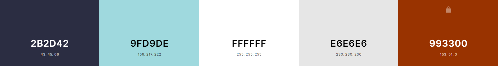
    *   #2b2d42 has been used for the main text and buttons
    *   #9fd9de has been used for the Nav, Footer and containers
    *   #ffffff has been used for the some text and boxes
    *   #e6e6e6 has been used for the main background color
    *   #993300 has been used for the blue hover response color

### **User Stories**

* **First Time Visitor Goals**

    * *As a First Time Visitor*, I want to be able to navigate the website simply and easily.

    * *As a First Time Visitor*, I want to access the site across all devices.
    * *As a First Time Visitor*, I want to see other users creations.
    * *As a First Time Visitor*, I want a a way to search other users creations.
    * *As a First Time Visitor*, I want to be able to sign up as a user.
    * *As a First Time Visitor*, I want to add my own creations.
    * *As a First Time Visitor*, I want a page where I can see my own creations.

* **Returning Visitor Goals**

    * *As a Returning Visitor*, I want to be able to inspect and edit my own creations.

    * *As a Returning Visitor*, I want other to view my creations but not edit them.
    * *As a Returning Visitor*, I want to easily navigate to the log in page to view my profile
    * *As a Returning Visitor*, I want to view all of the sandwiches I have added to the site
    * *As a Returning Visitor*, I want to be able to delete any of my own creations I no longer want.
    * *As a Returning Visitor*, I want to be able to log out of the site.

---

## **Features**

* The Project is a multi-page website which uses a MongoDB database and Jinja/Python template management.

    1. The Index page consists of a Nav section and footer section that feature on every page. It also includes an image carousel and a latest sandwiches section.
    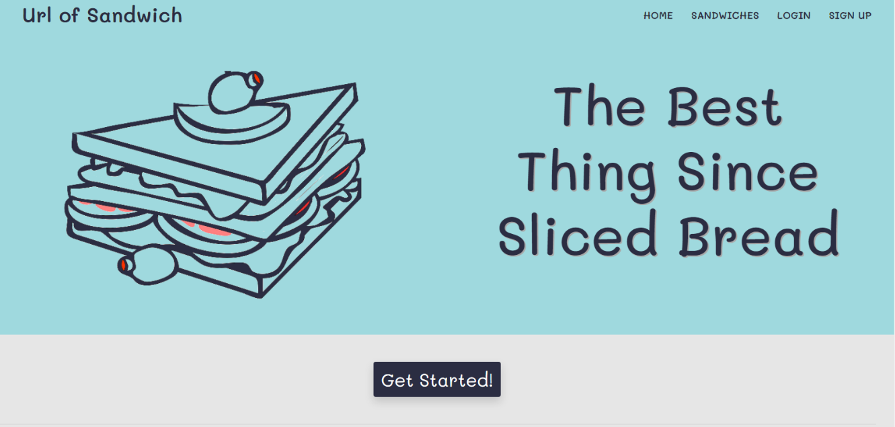    
    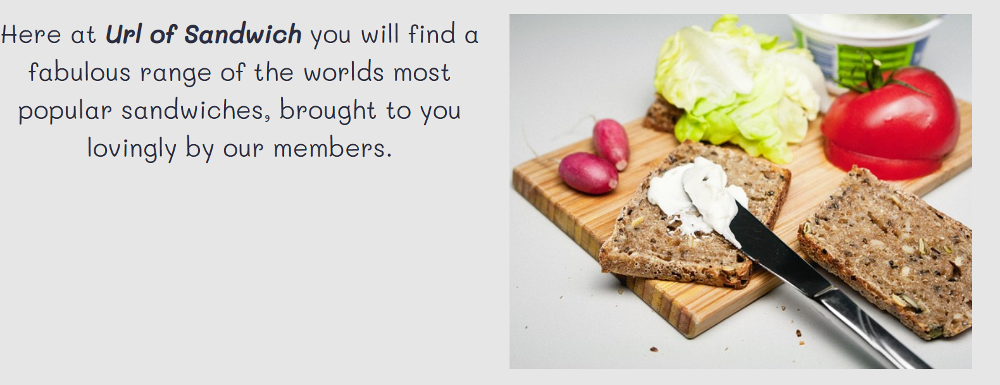    
    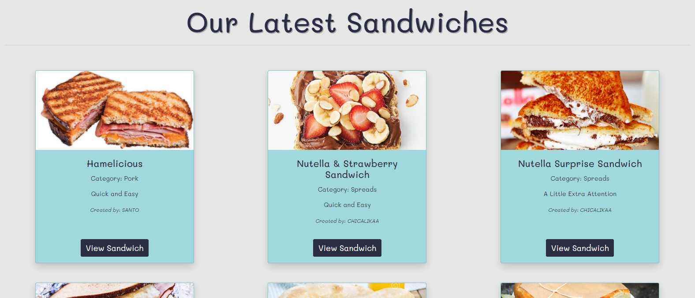    
    
    2. The sandwiches section displays the full database of sandwiches that users have created. Each sandwich has its own card with an image of the sandwich, it's name and prep time. Each card also has view sandwich button to allow the user to see each recipe. There is also a search bar allowing the user to search the sandwiches by ingredient.
    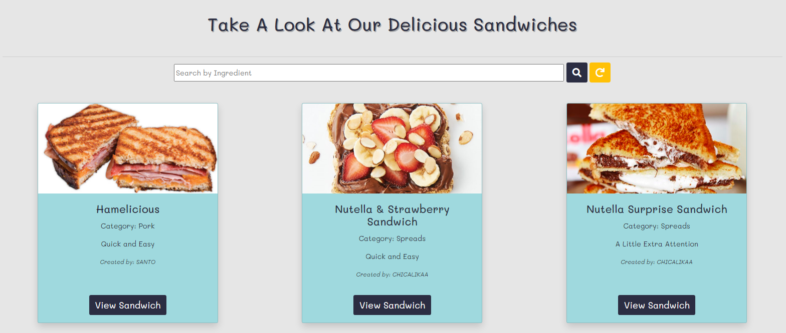
    
    3. The Login and Sign Up sections take the customer to the related page, allowing the customer to either login or sign up. The pages have links to each other incase the customer has click the wrong one.
    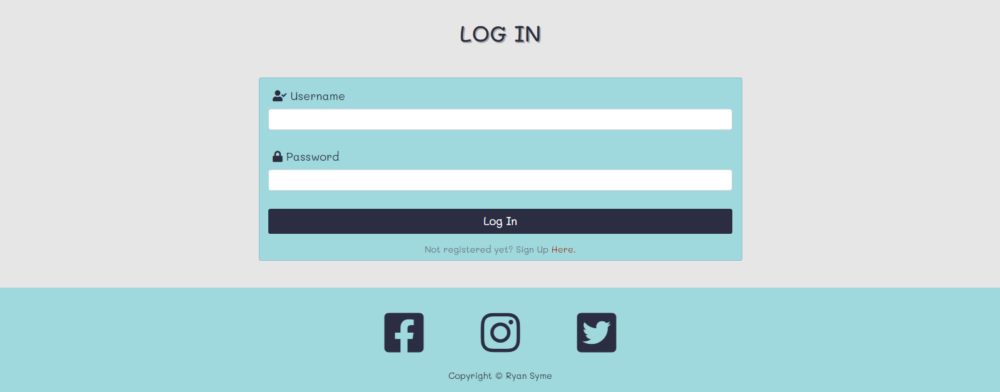
    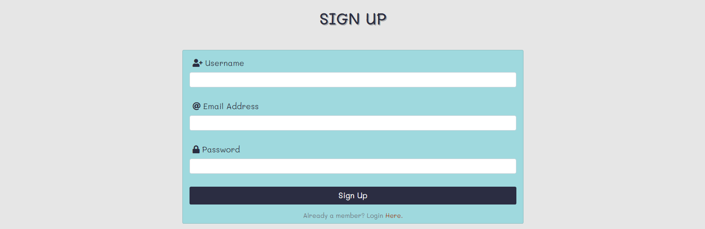
    
    4. The add sandwich page has a form which allows the customer to add a sandwich to the database.
    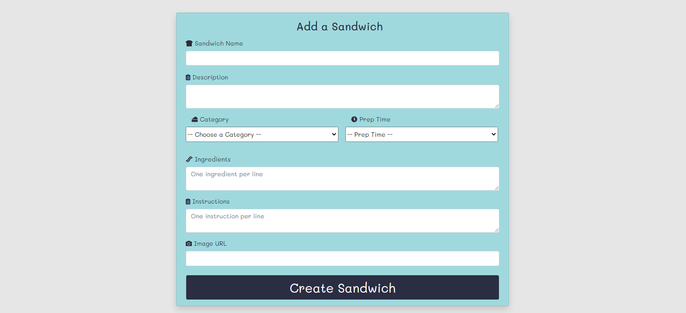
    
    5. The profile section shows the user their own creations which they can edit or delete if they wish.
    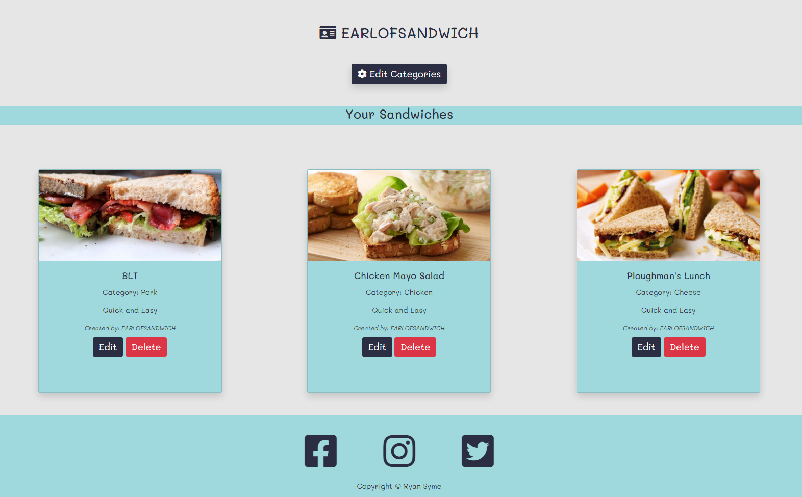
    
    6. The log out button logs the user out and returns them to the landing page.
    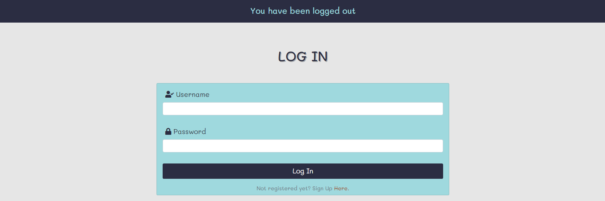

    7. The Earl of Sandwich (Admin) has an additional page where they can add, edit or remove categories.
    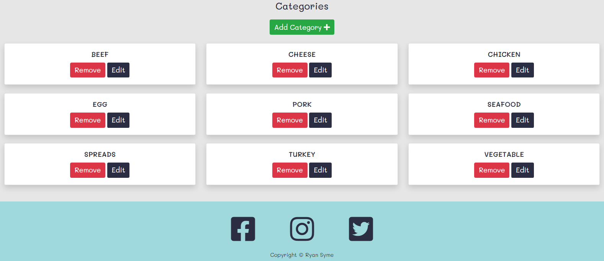

### **Existing Features**

*	The site has been designed to be responsive across all devices

*	The navbar remains on every page, allowing easy navigation at all times, It give the user the ability to move to the home page, add sandwich page, their profile page and to log out.
*	The navbar is styled differently for different screen sizes, changing from a three line “hamburger” dropdown nav on mobile to a traditional full screen navbar on larger screens
*	The user has the ability to sign up and/or login using the relative areas
*	The user can view all creations in the database
*   The user can search through all of the created sandwiches by any ingredient using the search bar.
*	The user has the ability to create, edit or remove any creation of their own making.
*	The footer displays the social media links.
*	The admin has the ability to add, edit or remove categories.

### **Features Left to Implement**

* A 'like' or grading feature that allows user to rate other users sandwiches

* The option to have more than one admin.
* The ability for the user to change password
* A 'Favourite section showing the users person favourites. 

---

## **Technologies Used**

All of the following technologies were used to create this website:-

### **Languages**

*	**HTML5**

*   **CSS3** 
*	**JavaScript**

    have been used throughout the project to create the text, style and functionality of the website.

*	[Python](https://www.python.org/) has been used to run the application

### **Frameworks and Libraries**

*   [Jquery]( https://jquery.com/) were used to implement the carousel function on the image carousel section and to simplify DOM manipulation

*	[MongoDB](https://www.mongodb.com/) has been used to to store the database
*	[Flask](https://flask.palletsprojects.com/en/1.1.x/) has been used to to dynamically generate pages, links, and content within the app
*	[PyMongo](https://pypi.org/project/pymongo/) has been used to connect to and transfer data to MongoDB
*	[Jinja](https://jinja.palletsprojects.com/en/2.11.x/) has been used to template the website
*	[Bootstrap]( https://getbootstrap.com/) was used for layout aesthetics, including grid styling and device responsiveness
*	[GitHub]( https://github.com/) was used to host the website
*	[Gitpod]( https://www.gitpod.io/) was used to code the website

### **Software and Resources**

*	[FontAwesome](https://fontawesome.com/) was used to add icons to the exercise class headers

*	[Gimp]( https://www.gimp.org/) was used to size the images
*	[Balsamiq]( https://balsamiq.com/) was used to create the wireframes of the project
*   [FireShot](https://getfireshot.com/) was used to create the screenshots for the README
*   [Techsini](https://techsini.com/multi-mockup/) was used to style the multi screen mockup
*   [Coolors](https://coolors.co/) was used to create the color palette screenshot
*   [User-Agent Switcher](https://chrome.google.com/webstore/detail/user-agent-switcher-for-c/djflhoibgkdhkhhcedjiklpkjnoahfmg) was used for testing functionality on different browsers

---

## **Testing**

### **Testing User Stories from the UX Section**

**First Time Visitor Goals**

* *As a First Time Visitor*, I want to be able to navigate the website simply and easily.
    *   On opening the website the visitor is met with the callout section which has a button connecting to the sign up page and a sticky nav directing the user to relevent pages

* *As a First Time Visitor*, I want to access the site across all devices.
    *	The website is responsive across all devices
    
* *As a First Time Visitor*, I want to see other users creations.
    *	The nav has a sandwiches button that links to a page that show all of the sandwiches in the database.

* *As a First Time Visitor*, I want a a way to search other users creations.
    *	The sandwiches page has a promenent search bar that allows the user to search through the the sandwiches by ingredient.

* *As a First Time Visitor*, I want to be able to sign up as a user.
    *   There is a sign up link in the nav and also a button under the callout guiding the user to the sign up page.
    *   The user only need to provide a user name email and password to sign up.

* *As a First Time Visitor*, I want to add my own creations.
    *   Any member can add a sandwich to the database via the 'add sandwich' page.
    *   The user can add any type of sandwich they wish and can add an image if they wish. If they choose not to add an image, one is added for them automatically.

* *As a First Time Visitor*, I want a page where I can see my own creations.
    *   A signed in user can view all of their own sandwich creations on their profile page.

**Returning Visitor Goals**

* *As a Returning Visitor*, I want to be able to inspect and edit my own creations.
    *   On the profile page, the user can edit or remove any of their own creation if they so choose.
    *   The user can also edit or remove their sandwiches from the view sandwich page.

* *As a Returning Visitor*, I want other users to view my creations but not edit them.
    *	Users can view any sandwich in the database via the sandwiches page and see them in more detail on the view sandwich page.
    *   No user can edit or delete another users sandwiches

* *As a Returning Visitor*, I want to easily navigate to the log in page to view my profile
    *	The sticky nav has a link to the login page
    *   Once logged in a user is directed to their profile page

* *As a Returning Visitor*, I want to view all of the sandwiches I have added to the site
    *   The users profile page displays a collection of all of their own sandwiches

* *As a Returning Visitor*, I want to be able to delete any of my own creations I no longer want.
    *   The user can edit or delete any of their own creations at any point as long as they are signed in
    *   Users can only edit or delete sandwiches that they have created.

* *As a Returning Visitor*, I want to be able to log out of the site.
    *   There is a log out button on the sticky nav that can be used on any page of the site.

### **Code Validation**

#### *W3 Validators*

*    The HTML was Validted at [W3C Markup Validation Service](https://validator.w3.org/). 

<!--  -->
<!--  -->

*    The CSS was validate at [W3C CSS Validation Service](http://jigsaw.w3.org/css-validator/).

<!--  -->

### **Manual Testing**

#### *Google Developer Tools*

   *    The websites design responsiveness has been tested on all device sizes using Google Developer Tools.

#### *Testing On Mobile Devices*
   *    Apple iOS
   *    Google Android 7
   *    Microsoft Windows Phone
   *    Samsung Tizen OS
   *    Nokia Symbian
   *    Mozilla Firefox OS
 
#### *Testing On Browsers*
   *    Google Chrome
   *    Opera
   *    Firefox
   *    Apple Safari
   *    Microsoft Explorer
   *    Microsoft Edge
    
#### *Testing On Operating Systems*
   *    Microsoft Windows
   *    Linux
   *    Apple Mac OS
   *    Google Chrome OS
   *    IBM Warp

    
#### *Issues Found*

*   An issue was found with the carousel and callout text being on the same line on different device sizes, the resizing would make the text too large and the carousel too small.
    *   The issue was resolved with some changes to the css in the media queries and by using the bootstrap grid system.

<!-- *   JSHint found a missing semi-colon in my JavaScript. -->
    <!-- *   The issue was fixed by adding the semi-colon -->

<!-- *   I was unable to make EmailJS function using the way I had been taught by Code Institute. -->
    <!-- *   The issue was fixed by using a newer piece of code from the [EmailJS](https://www.emailjs.com/docs/tutorial/creating-contact-form/) website. -->

---

## **Deployment**

### **Remote Deployment**
1. Navigate to the GitHub [Repository:](https://github.com/RyanSyme/url-of-sandwich)
2. Open [repository](https://github.com/RyanSyme/url-of-sandwich) using [GitPod](https://www.gitpod.io/) IDE.
3. In terminal run "pip3 freeze --local > requirements.txt" command to create a .txt file with all of the dependencies used that [Heroku](https://www.heroku.com) needs to know what dependencies app uses.
4. In the terminal run the "echo web: python app.py > Procfile" command to create Procfile that [Heroku](https://www.heroku.com) needs to know what file runs the app.
5. Go to [Heroku](https://www.heroku.com) and log in.
6. Once logged in, and in your dashboard, click on "Create New App".
7. Under "Create New App" click on the input field called "App Name".
8. Give your app a unique nameand select the closest region to your location.
9. Click "Create App"
10. In the "Deployment Method" section, connect the app by clicking on the "Github" icon.
11. Type the Github repo-name in the "Connect to Github" section input.
12. Click "search" to find the repo and once it is found click "connect".
13. Before clicking the "Enable Automatic Deployment" button, click on the settings tab in the top part of the page.
14. Click on "Reveal Config Var".
15. Here you can inform Heroku of which variables will be required.
16. The required variables are: (IP, PORT, MONGO_URI, MONGODB_NAME, SECRET_KEY).
17. Go back to [GitPod](https://www.gitpod.io/) and make sure that you have pushed your requirements.txt and Procfile to the repo.
18. Return to Heroku and click on "Enable Automatic Deployment".
19. Select your branch. Branch selected (master).
20. Click "Deploy Branch"
21. Once deployment is finished click "View" to launch the new app.

### **Local Deployment**
1. Navigate to the GitHub [Repository:](https://github.com/RyanSyme/url-of-sandwich)
2. Click the **Code** drop down menu.
3. Download the ZIP file and unpack locally
4. Open a code editor of your choice and open the unzipped file using the code editor.
5. Click **Save** and save to your local device
6. In order to have a functional app, you will have to create your own MongoDB collection and inserted your "MONGO_URI" and not the one used in the project.

---

## **Credits**

### **Content**

### **Media**

*   All images used for the carousel, logo and default sandwich card were obtained from [Pixabay](https://pixabay.com/)
    *   With special mention to:
        *   [andreas160578](https://pixabay.com/users/andreas160578-2383079/)
        *   [Christine_Sponchia](https://pixabay.com/users/sponchia-443272/)
        *   [Clker](https://pixabay.com/users/clker-free-vector-images-3736/)
        *   [LuckyLife11](https://pixabay.com/users/luckylife11-5245360/)
        *   [tookapic](https://pixabay.com/users/tookapic-1386459/)

### **Acknowledgements**

*	I received design inspiration from:

    *	The Data Centric Development Mini Project lesson from the [Code Institute](https://courses.codeinstitute.net/login) Full Stack Developer Course.

    *   Advice for improving my search bar code from my Code Institute mentor **Oluwafemi Medale**

    *   Additional help to create a default image on sandwich cards is credited to [StackOverflow](https://stackoverflow.com/questions/7995080/html-if-image-is-not-found)

*	I received styling inspiration from:

    *   [BBCGoodFood](https://www.bbcgoodfood.com/recipes/egg-less-mayo-sandwiches) 
    
*   Additional Thanks to my mentor **Oluwafemi Medale** for styling and formatting advice.